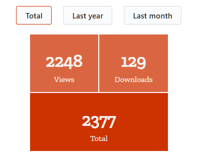

# Plugin métricas de artículos para OMP

Este plugin proporciona una forma sencilla y visual de mostrar las métricas de vistas y descargas de artículos o monografías en OMP. Con este módulo, puedes visualizar estadísticas de uso agrupadas por rangos de tiempo.

**Imagen del plugin:**



## Características

- Muestra las métricas de **vistas**, **descargas** y un **total** combinado.
- **Rangos de tiempo:** Total histórico, último año, y último mes.
- Compatible con OMP 3.4.
- Utiliza los servicios nativos de estadísticas de OMP para datos precisos.

## Instalación

1. Copia el contenido del directorio del plugin en la carpeta `plugins/generic` de tu instalación de OMP.
2. Activa el plugin desde el área de administración de plugins en OMP.
3. **Integración en la plantilla:** Copia el siguiente código en la plantilla deseada para mostrar el bloque de métricas:

```html
{$articleMetricsHtml nofilter}
```
